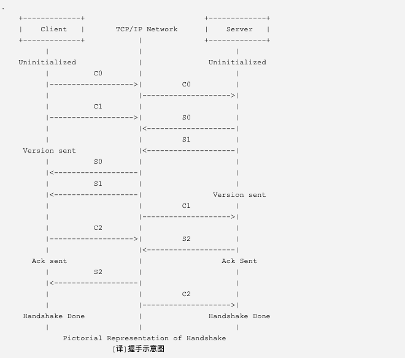
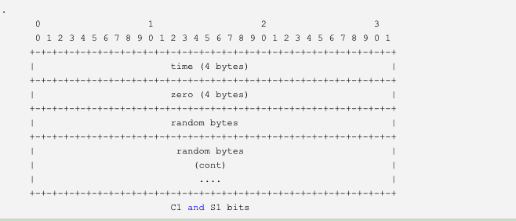
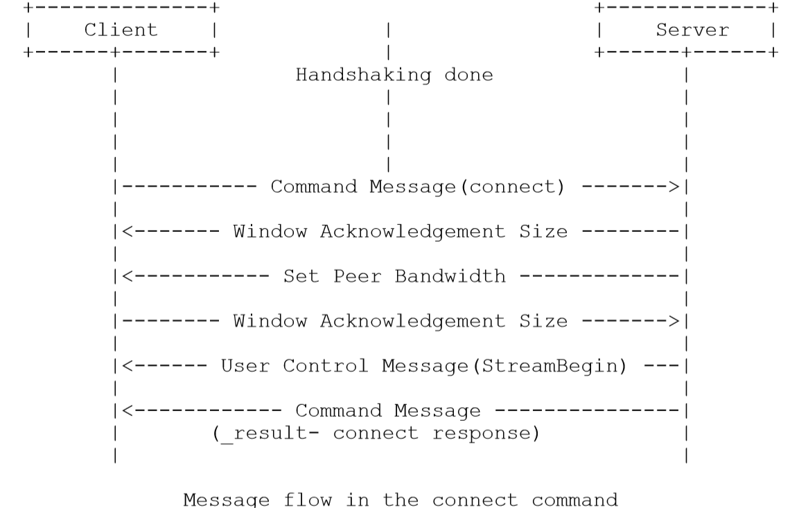
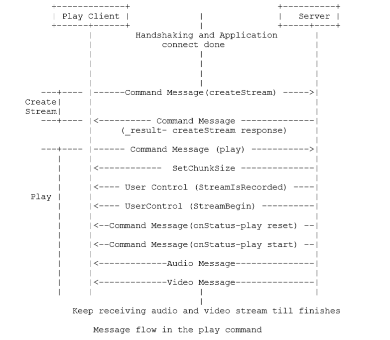

# 封包
> 在RTMP协议中信令和媒体数据都称之为Message，在网络中传输这些Message，为了区分它们肯定是要加一个Message header的，所以RTMP协议也有一个Message header，还有一个问题因为RTMP协议是基于TCP的（默认通信端口1935），由于TCP的包长度是有限制的（一般来说不超过1500个字节），而RTMP的Message长度是有可能很大的，像一个视频帧的包可能会有几十甚至几千K，这个问题就必然有一个分片的问题，在RTMP协议中对应的说法就是chunk，每一个Message + header都是由一个和多个chunk组成的。

## Message
### 报文格式

> 消息的报文格式同FLV文件的tag相同
- Message Type ID  
不同种类的消息包含不同的Message Type ID，代表不同的功能。RTMP协议中一共规定了十多种消息类型，分别发挥着不同的作用。
  - Message Type ID在1-7的消息用于协议控制，这些消息一般是RTMP协议自身管理要使用的消息，用户一般情况下无需操作其中的数据。
  - Message Type ID为8，9的消息分别用于传输音频和视频数据、18是脚本
  - Message Type ID为15-20的消息用于发送AMF编码的命令，负责用户与服务器之间的交互，比如播放，暂停等等。
-  Payload Length  
包长度
- Time Stamp  
时间戳
- Stream ID  
流ID
- Message Body  
音视频裸流(h264/aac/g711)

## Chunk
> 在网络上传输数据时，消息需要被拆分成较小的数据块，才适合在相应的网络环境上传输。RTMP协议中规定，消息在网络上传输时被拆分成消息块（Chunk）。消息块首部（Chunk Header）有三部分组成：用于标识本块的Chunk Basic Header，用于标识本块负载所属消息的Chunk Message Header，以及当时间戳溢出时才出现的Extended Timestamp。
### 报文格式

#### Chunk Basic Header  
格式

fmt(2bit) | cs id (6bit) 
---|---

- fmt  
fmt也称为head type，决定了`Chunk Message Header`的长度。  
- cs id
`Chunk Basic Header`的长度是变长的，可能为1、2、3个byte，取决于`cs id`，这里的`cs id`是`chunk stream id`的简写。每次在发送一个不同类型的RTMP消息时都要有不用的chunk stream ID, 如上一个Message 是command类型的，之后要发送视频类型的消息，视频消息的chunk stream ID 要保证和上面 command类型的消息不同。协议最大支持65597个`cs id `从3-65599. `cs id` 0、1、2为协议保留，0代表ID是64~319(第二个byte + 64). 1代表chunk stream ID为6-65599（（第三个byte）* 256 + 第二个byte + 64）(小端表示). 2代表该消息为低层的协议（在RTMP协议中控制信令的chunk stream ID都是2). 3-63的chunk stream ID就是该byte的值。

cs id为0时：

cs id为1时：

cs id为非0或1时：

#### Chunk Message Header
> Chunk Message Header的长度是变长的，取决于`Chunk Type`(fmt)的值。共有四种不同的格式。其中第一种格式可以表示其他三种表示的所有数据，但由于其他三种格式是基于对之前chunk的差量化的表示(类似于h264的I帧P帧)，因此可以更简洁地表示相同的数据，实际使用的时候还是应该采用尽量少的字节表示相同意义的数据。

  - Chunk Type(fmt)=0时,长度为11bytes  
    
  type=0时Message Header占用11个字节，其他三种能表示的数据它都能表示，当在chunk stream 的开始第一个chunk和头信息中的时间戳后退（即值与上一个chunk相比减小，通常在回退播放的时候会出现这种情况）的时候必须采用这种格式。
    - timestamp（时间戳）：占用3个字节，因此它最多能表示到16777215=0xFFFFFF=2^24-1，当它
的值超过这个最大值时，这三个字节都置为1，这样实际的timestamp会转存到 Extended
Timestamp 字段中，接收端在判断timestamp字段24个位都为1时就会去Extended Timestamp
中解析实际的时间戳。
    - message length（消息数据长度）：占用3个字节，表示实际发送的消息的数据如音频帧、视频
帧等数据的长度，单位是字节。注意这里是Message的长度，也就是chunk属于的Message的总长
度，而不是chunk本身data的长度。
    - message type id(消息的类型id)：1个字节，表示实际发送的数据的类型，如8代表音频数据，
9代表视频数据。
    - message stream id(消息的流id)：4个字节，表示该chunk所在的流的ID，和Basic Header
的CSID一样，它采用小端存储方式。

  - Chunk Type(fmt)=1时,长度为7bytes  
    
  type为1时占用7个字节，省去了表示message stream id的4个字节，表示此chunk和上一次发的 chunk 所在的流相同，如果在发送端和对端有一个流链接的时候可以尽量采取这种格式。
    - timestamp delta：3 bytes，这里和type=0时不同，存储的是和上一个chunk的时间差。类似
上面提到的timestamp，当它的值超过3个字节所能表示的最大值时，三个字节都置为1，实际
的时间戳差值就会转存到Extended Timestamp字段中，接收端在判断timestamp delta字段24
个bit都为1时就会去Extended Timestamp 中解析实际的与上次时间戳的差值。
    - 其他字段与上面的解释相同.

  - Chunk Type(fmt)=2时,长度为3bytes 
    
  type 为 2 时占用 3 个字节，相对于 type = 1 格式又省去了表示消息长度的3个字节和表示消息类型的1个字节，表示此 chunk和上一次发送的 chunk 所在的流、消息的长度和消息的类型都相同。余下的这三个字节表示 timestamp delta，使用同type=1。
  
   - Chunk Type(fmt)=3时,长度为0bytes   
   type=3时，为0字节，表示这个chunk的Message Header和上一个是完全相同的。当它跟在type=0的chunk后面时，表示和前一个 chunk 的时间戳都是相同。什么时候连时间戳都是相同呢？就是一个 Message 拆分成多个 chunk，这个 chunk 和上一个 chunk 同属于一个 Message。而当它跟在 type = 1或 type = 2 的chunk后面时的chunk后面时，表示和前一个 chunk的时间戳的差是相同的。比如第一个 chunk 的 type = 0，timestamp = 100，第二个 chunk 的 type = 2，timestamp delta = 20，表示时间戳为 100 + 20 = 120，第三个 chunk 的 type = 3，表示 timestamp delta = 20,时间戳为 120 + 20 = 140。

#### Extended Timestamp(扩展时间戳)
在 chunk 中会有时间戳 timestamp 和时间戳差 timestamp delta，并且它们不会同时存在，只有这两者之一大于3字节能表示的最大数值 0xFFFFFF ＝ 16777215 时，才会用这个字段来表示真正的时间戳，否则这个字段为 0。扩展时间戳占 4 个字节，能表示的最大数值就是 0xFFFFFFFF ＝ 4294967295。当扩展时间戳启用时，timestamp字段或者timestamp delta要全置为1，而不是减去时间戳或者时间戳差的值。

# RTMP流媒体播放过程
RTMP协议规定，播放一个流媒体有两个前提步骤：第一步，建立一个网络连接（NetConnection）；第二步，建立一个网络流（NetStream）。其中，网络连接代表服务器端应用程序和客户端之间基础的连通关系。网络流代表了发送多媒体数据的通道。服务器和客户端之间只能建立一个网络连接，但是基于该连接可以创建很多网络流。
播放一个RTMP协议的流媒体需要经过以下几个步骤：
- 握手（RTMP连接都是以握手作为开始）
- 建立连接（建立客户端与服务器之间的“网络连接”）
- 建立流（建立客户端与服务器之间的“网络流”）
- 播放 （传输视音频数据） 

RTMP连接都是以握手作为开始的。建立连接阶段用于建立客户端与服务器之间的“网络连接”；建立流阶段用于建立客户端与服务器之间的“网络流”；播放阶段用于传输视音频数据。

## 握手
RTMP 握手分为简单握手和复杂握手，一般使用简单握手较多，复杂握手不做介绍。要建立一个有效的RTMP Connection链接，首先要“握手”:客户端要向服务器发送C0,C1,C2（按序）三个chunk，服务器向客户端发送S0,S1,S2（按序）三个chunk，然后才能进行有效的信息传输。RTMP协议本身并没有规定这6个Message的具体传输顺序

- 客户端开始发送C0,C1；
- 客户端必须收到S1后，才发送C2;
- 客户端必须收到S2后才开始发送其他信息（控制信息和音视频数据） 服务器要等收到C0才能发送S0和S1；
- 服务器必须等C1后才能发送S2 服务器必须等收到C2之后才能发送其他数据（控制信息和音视频数据）

### C0 和 S0 格式

- version（1 byte）：版本。在 C0 包内，这个字段代表客户端请求的 RTMP 版本号。在 S0 包内，这个字段代表服务端选
择的 RTMP 版本号。当前使用的版本是 3。版本 0-2 用在早期的产品中，如今已经弃用；版本 4-31 被预留用于后续产
品；版本 32-255 （为了区分 RTMP 协议和文本协议，文本协议通常是可以打印字符）不允许使用。如果服务器无法识别
客户端的版本号，应该回复版本 3。客户端可以选择降低到版本 3，或者终止握手过程。

### C1 和 S1 格式

- time（4 bytes）：本字段包含一个时间戳，客户端应该使用此字段来标识所有流块的时刻。时间戳取值可以为零或其他
任意值。为了同步多个块流，客户端可能希望多个块流使用相同的时间戳。
- zero（4 bytes）：本字段必须为零。
- random （1528 bytes）：本字段可以包含任意数据。由于握手的双方需要区分另一端，此字段填充的数据必须足够随机
（以防止与其他握手端混淆）。不过没有必要为此使用加密数据或动态数据。

###  C2 和 S2 格式

- time（4 bytes）：本字段必须包含对端发送的时间戳。
- time2（4 bytes）：本字段必须包含时间戳，取值为接收对端发送过来的握手包的时刻。
- random（1528 bytes）：本字段必须包含对端发送过来的随机数据。握手的双方可以使用时间 1 和时间 2 字段来估算
网络连接的带宽和/或延迟，但是不一定有用。

## 建立连接(NetConnection)
  

- 客户端发送命令消息中的“连接”(connect)到服务器，请求与一个服务应用实例建立连接。
- 服务器接收到连接命令消息后，发送确认窗口大小(Window Acknowledgement Size)协议消息到客户端，同时连接到连接命令中提到的应用程序。
- 服务器发送设置带宽协议消息到客户端。
- 客户端处理设置带宽协议消息后，发送确认窗口大小(Window Acknowledgement Size)协议消息到服务器端。
- 服务器发送用户控制消息中的“流开始”(Stream Begin)消息到客户端。
- 服务器发送命令消息中的“结果”(_result)，通知客户端连接的状态。   

## 建立流(NetStream) & 播放(Play)
  
- 客户端发送命令消息中的“创建流”（createStream）命令到服务器端。
- 服务器端接收到“创建流”命令后，发送命令消息中的“结果”(_result)，通知客户端流的状态。
- 客户端发送命令消息中的“播放”（play）命令到服务器。
- 接收到播放命令后，服务器发送设置块大小（ChunkSize）协议消息。
- 服务器发送用户控制消息中的“streambegin”，告知客户端流ID。
- 播放命令成功的话，服务器发送命令消息中的“响应状态” NetStream.Play.Start & NetStream.Play.reset，告知客户端“播放”命令执行成功。
- 在此之后服务器发送客户端要播放的音频和视频数据。

# 参考链接
- RTMP官方协议
http://wwwimages.adobe.com/www.adobe.com/content/dam/Adobe/en/devnet/rtmp/pdf/rtmp_specification_1.0.pdf

- 开源项目 RTMP Dump  
http://rtmpdump.mplayerhq.hu/
